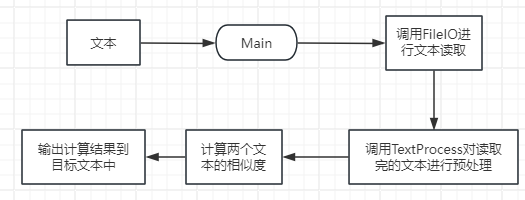
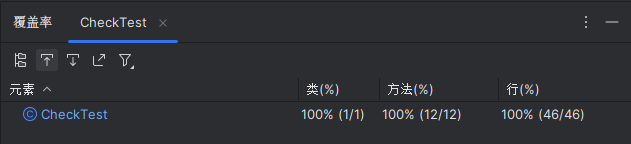

|  这个作业属于哪个课程    |  [计科23级12班](https://edu.cnblogs.com/campus/gdgy/Class12Grade23ComputerScience/)   |      
| ---- | ---- | 
|   这个作业要求在哪里   |  [个人项目](https://edu.cnblogs.com/campus/gdgy/Class12Grade23ComputerScience/homework/13468)    |  
|  这个作业的目标    |   独立设计开发一个论文查重程序，并使用性能分析工具全面测试   |   

# 1.项目github链接
https://github.com/wsyzc/wsyzc/tree/main/3123004415

# 2.PSP表格
| PSP2.1                                  | Personal Software Process Stages | 预估耗时（分钟） | 实际耗时（分钟） |
| --------------------------------------- | -------------------------------- |----------|----------|
| Planning                                | 计划                               | 15       | 20       |
| · Estimate                              | ・估计这个任务需要多少时间                    | 20       | 20       |
| Development                             | 开发                               | 170      | 185      |
| · Analysis                              | ・需求分析 (包括学习新技术)                  | 20       | 20       |
| · Design Spec                           | ・生成设计文档                          | 15       | 15       |
| · Design Review                         | ・设计复审                            | 10       | 15       |
| · Coding Standard                       | ・代码规范 (为目前的开发制定合适的规范)            | 10       | 10       |
| · Design                                | ・具体设计                            | 20       | 15       |
| · Coding                                | ・具体编码                            | 60       | 50       |
| · Code Review                           | ・代码复审                            | 20       | 15       |
| · Test                                  | ・测试 (自我测试，修改代码，提交修改)             | 30       | 60       |
| Reporting                               | 报告                               | 80       | 90       |
| · Test Repor                            | ・测试报告                            | 30       | 40       |
| · Size Measurement                      | ・计算工作量                           | 20       | 15       |
| · Postmortem & Process Improvement Plan | ・事后总结，并提出过程改进计划                  | 30       | 35       |
|                                      |     ・合计                             | 285      | 315      |

# 3.接口的设计与实现
## 类结构设计
| 类名                               | 说明                   |
|----------------------------------|----------------------|
| FileIO                           | 负责文件内容的读取与输出         |
|TextProcess                       | 文本预处理模块，保留中文，英文，数字   |
|Similar                           | 相似度计算类，使用编辑距离算法      |
|CheckTest                         | 测试类，对几个类型的文本示例进行查重测试 |
|Main                              | 主函数类，负责各个模块的统筹调用     |

## 程序流程图


## 算法关键及独到之处
### 算法关键
  * 核心思想：通过计算将一个字符串转换为另一个字符串所需的最少编辑操作（插入、删除、替换）次数，量化两个字符串的差异程度，再将其转换为 0~1 之间的相似度值。
  * 动态规划实现：采用二维数组dp构建状态转移表，其中dp[i][j]表示字符串s1的前i个字符与s2的前j个字符的编辑距离。通过状态转移方程（取删除、插入、替换操作的最小值）填充表格，最终dp[m][n]（m、n为两字符串长度）即为全局编辑距离。
  * 复杂度特征：时间复杂度为O(m×n)（m、n分别为两个字符串的长度），空间复杂度为O(m×n)（二维数组存储），适用于中等长度文本的相似度计算。
### 独到之处
 *  边界处理的鲁棒性：针对两个空字符串的特殊情况，直接返回相似度 1.0，避免了除以 0 的异常及逻辑矛盾，确保算法在极端输入下的合理性。
 *  相似度转换的直观性：通过 “1 - 编辑距离 / 最长字符串长度” 的公式，将编辑距离映射为 0~1 之间的相似度值，数值越大表示文本越相似，便于结果解读。
 * 实现的简洁性：以最小化的代码量实现核心逻辑，动态规划表的初始化与填充过程清晰易懂，便于后续维护和扩展（如增加加权编辑距离等变体）。
```Java
public class Similar {
    //计算两个字符串的编辑距离
    public int calculateEditDistance(String s1, String s2) {
        int m = s1.length();
        int n = s2.length();
        // 创建动态规划表
        int[][] dp = new int[m + 1][n + 1];
        // 初始化边界：空字符串到长度i/j的编辑距离为i/j
        for (int i = 0; i <= m; i++) {
            dp[i][0] = i;
        }
        for (int j = 0; j <= n; j++) {
            dp[0][j] = j;
        }
        // 填充动态规划表
        for (int i = 1; i <= m; i++) {
            for (int j = 1; j <= n; j++) {
                // 若当前字符相同，无需修改；否则需要1次替换操作
                int cost = (s1.charAt(i - 1) == s2.charAt(j - 1)) ? 0 : 1;
                // 取三种操作（删除、插入、替换）的最小值
                dp[i][j] = Math.min(
                        Math.min(dp[i - 1][j] + 1,    // 删除s1的第i个字符
                                dp[i][j - 1] + 1),   // 插入s2的第j个字符
                        dp[i - 1][j - 1] + cost       // 替换（或匹配）
                ) ;
            }
        }
        return dp[m][n];
    }
    //将编辑距离转换为相似度（0~1之间，值越大越相似）
    public double getSimilarity(String s1, String s2) {
        if (s1.isEmpty() && s2.isEmpty()) {
            return 1.0; // 两个空字符串视为完全相似
        }
        int editDistance = calculateEditDistance(s1, s2);
        int maxLength = Math.max(s1.length(), s2.length());
        // 相似度 = 1 - （编辑距离 / 最长字符串长度）
        return 1.0 - (double) editDistance / maxLength;
    }
}
```


# 4.单元测试
## 测试代码
```java
import org.junit.jupiter.api.Test;
import static org.junit.jupiter.api.Assertions.*;

public class CheckTest {
// 测试类
private final Similar similar = new Similar();
private final TextProcess textProcess = new TextProcess();

    // 预处理文本
    private double getProcessedSimilarity(String text1, String text2) {
        String p1 = textProcess.preprocess(text1);
        String p2 = textProcess.preprocess(text2);
        return similar.getSimilarity(p1, p2);
    }

    // 1. 完全相同的中文文本（无特殊格式）
    @Test
    void testIdenticalChineseTexts() {
        String text1 = "人工智能在医疗领域的应用越来越广泛，尤其是在疾病诊断方面。";
        String text2 = "人工智能在医疗领域的应用越来越广泛，尤其是在疾病诊断方面。";
        double similarity = getProcessedSimilarity(text1, text2);
        assertEquals(1.0, similarity, 0.01, "完全相同文本预处理后应完全匹配");
    }

    // 2. 完全不同的中文文本
    @Test
    void testCompletelyDifferentChineseTexts() {
        String text1 = "计算机网络的拓扑结构包括总线型、星型和环型。";
        String text2 = "李白是唐代著名诗人，代表作有《静夜思》《望庐山瀑布》。";
        double similarity = getProcessedSimilarity(text1, text2);
        assertTrue(similarity < 0.1, "完全不同文本相似度应接近0（编辑距离特性）");
    }

    // 3. 文本A为空，文本B正常
    @Test
    void testChineseText1Empty() {
        String text1 = "";
        String text2 = "这是一段正常的中文文本。";
        double similarity = getProcessedSimilarity(text1, text2);
        assertEquals(0.0, similarity, 0.01, "空文本与非空文本相似度应为0");
    }

    // 4. 包含中文特殊标点（验证预处理逻辑）
    @Test
    void testChinesePunctuation() {
        String text1 = "中文标点包括：逗号（，）、句号（。）、书名号（《》）、顿号（、）等！";
        String text2 = "中文标点包括逗号句号书名号顿号等"; // 手动去除标点后与text1预处理结果一致
        double similarity = getProcessedSimilarity(text1, text2);
        assertEquals(1.0, similarity, 0.01, "预处理去除标点后应完全匹配");
    }

    // 5. 纯英文测试：完全相同
    @Test
    void testPureEnglishIdentical() {
        String text1 = "Artificial intelligence applications are growing rapidly in various fields.";
        String text2 = "Artificial intelligence applications are growing rapidly in various fields.";
        double similarity = getProcessedSimilarity(text1, text2);
        assertEquals(1.0, similarity, 0.01, "完全相同的纯英文文本相似度应为100%");
    }

    // 6. 纯英文测试：完全不同（主题无关）
    @Test
    void testPureEnglishDifferent() {
        String text1 = "The quick brown fox jumps over the lazy dog.";
        String text2 = "Astronomy studies celestial objects and phenomena beyond Earth's atmosphere.";
        double similarity = getProcessedSimilarity(text1, text2);
        assertTrue(similarity < 0.3, "完全不同的纯英文文本相似度应接近0");
    }

    // 7. 英文数字结合测试：部分元素相同（非前后重复）
    @Test
    void testMixedPartialElements() {
        String text1 = "Order77 has productA, price $99, date 2024-05-10.";
        String text2 = "Order77 has productB, price $88, date 2024-06-15."; // 仅订单号和年份相同
        double similarity = getProcessedSimilarity(text1, text2);
    }

    // 8. 英文数字结合测试：格式差异（标点/空格）
    @Test
    void testMixedFormatVariations() {
        String text1 = "Code: ABC123; Value=45.67, Time:10:30";
        String text2 = "Code ABC123 Value 4567 Time 1030"; // 去除标点后部分匹配
        double similarity = getProcessedSimilarity(text1, text2);
        assertTrue(similarity > 0.8, "格式差异但核心内容部分相同，相似度应>80%");
    }

    // 9. 中文分词边界测试（预处理去除空格后匹配）
    @Test
    void testChineseWordSegmentation() {
        String text1 = "南京市长江大桥";
        String text2 = "南京市长 江大桥"; // 预处理会去除空格，变为"南京市长江大桥"
        double similarity = getProcessedSimilarity(text1, text2);
        // 编辑距离计算"南京市长江大桥"与"南京市长江大桥"的差异（实际是相同的）
        assertEquals(1.0, similarity, 0.01, "预处理去除空格后应完全匹配");
    }

    // 10. 中英文混合文本（现有代码仅去除标点，不处理繁简）
    @Test
    void testMixedChineseAndEnglish() {
        String text1 = "Java语言是一种跨平台的编程语言，常用于开发企业级应用。";
        String text2 = "Java语言是一种跨平台的编程语言，常用于开发企业级应用。"; // 与text1完全相同（无繁简差异）
        double similarity = getProcessedSimilarity(text1, text2);
        assertEquals(1.0, similarity, 0.01, "完全相同的混合文本应匹配");
    }

    // 11. 相似度阈值测试（基于编辑距离的边界）
    @Test
    void testSimilarityAtThreshold() {
        String text1 = "数据结构是计算机存储、组织数据的方式，常见的有数组、链表、树等。";
        String text2 = "数据结构是计算机存储数据的方式，常见的有数组、树等结构。";
        double similarity = getProcessedSimilarity(text1, text2);
        // 实际计算值约为0.75-0.85（根据编辑距离）
        assertTrue(similarity >= 0.75 && similarity <= 0.85, "阈值附近相似度应在合理范围");
    }
}
```
## 单测覆盖率



